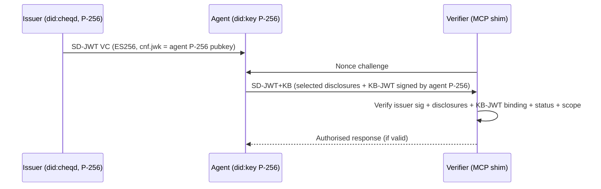

---

# I2H2A Specification v0.2

## Issuer to Holder to Agent Delegation Credential

**Version:** 0.2
**Status:** Draft — not for publication
**Date:** 2026-04-17

---

## Changelog

### v0.1 → v0.2 Draft

| # | Change | Section(s) affected |
|---|--------|-------------------|
| 1 | Credential format changed from JWT-VC to SD-JWT VC (RFC 9901) | 2.6, 3, 4 |
| 2 | Signing algorithm changed from EdDSA/Ed25519 to ES256/P-256 throughout | 2.6, 3, 9.1 |
| 3 | Field visibility map added as normative section | 2.7 (new) |
| 4 | `vct` claim replaces `type` array in SD-JWT context | 2.2, 2.3 |
| 5 | `cnf.jwk` (P-256 public key) added to credential schema | 2.3 |
| 6 | `_sd` and `_sd_alg` fields added to credential schema | 2.3 |
| 7 | VP mechanics updated for SD-JWT Key Binding (KB-JWT) presentation | 4, 5.2 |
| 8 | Verification algorithm updated for SD-JWT+KB | 4 |
| 9 | DID document example updated from Ed25519VerificationKey2020 to JsonWebKey2020 (P-256) | 9.1 |
| 10 | Normative references updated: added RFC 9901, SD-JWT VC draft, RFC 7518; removed RFC 8032 | 10 |

---

### Abstract

Autonomous AI agents increasingly act on behalf of humans at scale, yet verifiers (including MCP servers) require **cryptographic proof** that an agent is authorized to perform specific operations. Today there is no widely adopted, **standard** verifiable credential type that cleanly expresses **human-to-agent delegation** while allowing the **agent** to prove possession and to **sign its own Verifiable Presentations (VPs)** without returning to the human's issuer for every session.

This specification defines **I2H2A** (Issuer to Holder to Agent), a credential type using **SD-JWT VC** format (RFC 9901) with **ES256/P-256** signatures throughout. An I2H2A credential **chains** a human holder's identity (as issuer of the delegation) to an **agent-controlled** decentralized identifier (typically **`did:key`** with a P-256 key), with explicit **delegation scope**, selective disclosure of sensitive fields, optional **opaque authorization** data for platform policy, and **revocation** via Bitstring Status List anchored on cheqd.

The key innovation is operational: the **holder issues** the I2H2A credential to the agent; the **agent** holds its own keys and **autonomously** constructs and signs SD-JWT+KB presentations for verifiers. I2H2A is **DID-method agnostic** for the human and **VC-platform agnostic** for issuance and verification, enabling interoperability across wallets, identity providers, and verifier middleware without mandating any single vendor, ledger, or proprietary stack.

The ES256/P-256 algorithm selection aligns with Mastercard Verifiable Intent (MC VI), enabling future multi-credential VP presentations where an I2H2A delegation credential and an MC VI payment credential are co-presented in a single VP to an MCP server.

---

### 1. Terminology

The key words **MUST**, **MUST NOT**, **REQUIRED**, **SHALL**, **SHALL NOT**, **SHOULD**, **SHOULD NOT**, **RECOMMENDED**, **MAY**, and **OPTIONAL** are to be interpreted as described in [RFC 2119](https://www.rfc-editor.org/rfc/rfc2119) and [RFC 8174](https://www.rfc-editor.org/rfc/rfc8174) when, and only when, they appear in all capitals, as normative requirements in this document.

- **Issuer:** The party that issues the I2H2A credential — either the platform issuer (a `did:cheqd` DID) in the reference implementation, or any conformant issuer. The issuer MUST sign the SD-JWT VC with an ES256/P-256 key registered in their DID document as a `JsonWebKey2020` verification method.
- **Holder:** The verified human on whose behalf the agent acts. Identified by `delegatedBy` claim (a `did:cheqd` DID in the reference implementation). The holder authorises delegation but does not directly sign the SD-JWT VC in the H2A model.
- **Agent:** An autonomous system (software process) identified by `credentialSubject.id` (a P-256 `did:key`). The agent MUST control the private key corresponding to the `cnf.jwk` public key embedded in the credential, and MUST use that key to sign the KB-JWT in SD-JWT presentations.
- **Verifier:** A system that receives an SD-JWT+KB presentation and MUST execute the verification algorithm in Section 4 before relying on the delegation. Examples include MCP servers, APIs, and policy enforcement points.
- **SD-JWT VC:** A Verifiable Credential secured as a Selective Disclosure JWT per RFC 9901. Consists of an Issuer-signed JWT plus zero or more `~`-separated disclosures, optionally followed by a Key Binding JWT (KB-JWT).
- **KB-JWT:** Key Binding JWT. A JWT signed by the agent's private key, binding the SD-JWT presentation to a specific audience and nonce. MUST be appended to SD-JWT+KB presentations per RFC 9901.
- **Disclosure:** A base64url-encoded JSON array `[salt, claim_name, claim_value]` revealing one selectively disclosable claim. The verifier MUST verify each disclosure's hash against the `_sd` array in the SD-JWT payload.
- **`cnf.jwk`:** The agent's P-256 public key embedded in the credential, used for holder binding verification. The verifier MUST confirm the KB-JWT was signed by the private key corresponding to `cnf.jwk`.
- **Delegation Scope:** Constraints embedded in `credentialSubject.scope` describing what the agent is permitted to do. Selectively disclosable. Verifiers MUST enforce scope.
- **Authorization Payload:** The `credentialSubject.authorization` object. Opaque to generic I2H2A verifiers. Selectively disclosable. Contains the A2AUAS payload in platform deployments.
- **Delegation Depth:** Non-negative integer. For V1, `delegationDepth` MUST be `0`. Selectively disclosable.
- **Status List:** Bitstring Status List credential anchored on cheqd blockchain. Used to determine revocation status.

---

### 2. I2H2A Credential Schema

#### 2.1 Conformance

An I2H2A SD-JWT VC:

1. MUST use `vct` claim value `"I2H2A"`.
2. MUST be signed with ES256 (P-256) by the issuer.
3. MUST include `cnf.jwk` containing the agent's P-256 public key.
4. MUST include `_sd_alg: "sha-256"`.
5. MUST conform to RFC 9901 SD-JWT VC format.

#### 2.2 Always-visible claims (I2H2A credential)

The following claims MUST always be disclosed — they MUST NOT appear in the `_sd` array:

| Claim | Requirement |
|-------|-------------|
| `iss` | MUST be the issuer DID (e.g. `did:cheqd`) |
| `sub` | MUST be the agent DID (P-256 `did:key`) |
| `iat` | MUST be a Unix timestamp (issuance time) |
| `nbf` | MUST be a Unix timestamp (not-before time) |
| `exp` | MUST be a Unix timestamp (expiry time) |
| `vct` | MUST be the string `"I2H2A"` |
| `credentialStatus` | MUST be present; MUST conform to Section 2.5 |
| `cnf` | MUST be present; MUST contain `jwk` sub-object with agent's P-256 public key |
| `_sd_alg` | MUST be `"sha-256"` |

#### 2.3 Selectively disclosable claims (I2H2A credential)

The following claims MUST appear as SD-JWT disclosures (their hashes in the `_sd` array, values in separate disclosure objects):

| Claim | Description |
|-------|-------------|
| `delegatedBy` | Human holder DID (e.g. `did:cheqd`) |
| `parentCredential` | MUST be `null` for V1 |
| `delegationDepth` | MUST be integer `0` for V1 |
| `scope.mcpServers` | Array of permitted MCP server identifiers |
| `scope.taskType` | String describing permitted task class |
| `authorization` | Opaque object; contains A2AUAS payload in platform deployments |

#### 2.4 Always-visible claims (Human Identity VC)

| Claim | Requirement |
|-------|-------------|
| `iss` | Issuer DID |
| `sub` | Holder DID |
| `iat` | Issuance timestamp |
| `exp` | Expiry timestamp |
| `vct` | MUST be `"HumanIdentityCredential"` |
| `credentialStatus` | Bitstring Status List entry |
| `cnf` | Holder's P-256 public key |
| `kycAssuranceLevel` | KYC assurance level string |

#### 2.5 Selectively disclosable claims (Human Identity VC)

| Claim | Description |
|-------|-------------|
| `givenName` | Given name |
| `familyName` | Family name |
| `dateOfBirth` | Date of birth |
| `ageOver18` | Boolean age predicate |
| `nationality` | Nationality |
| `documentIssuingCountry` | Document issuing country |
| `documentTypeVerified` | Document type used for KYC |
| `kycProvider` | KYC provider identifier |
| `biometricBindingRef` | Biometric binding reference |

#### 2.6 `credentialStatus`

| Property | Requirement |
|----------|-------------|
| `id` | URI identifying the status list entry |
| `type` | MUST be `"BitstringStatusListEntry"` |
| `statusListIndex` | Non-negative integer index |
| `statusListCredential` | URI resolving to the Bitstring Status List credential on cheqd |

#### 2.7 SD-JWT VC encoding (normative)

I2H2A credentials MUST be encoded as SD-JWT VCs per RFC 9901.

**Issuer-signed JWT header:**
```json
{
  "alg": "ES256",
  "typ": "vc+sd-jwt",
  "kid": "#key-1"
}
```

**Issuer-signed JWT payload (normative structure):**
```json
{
  "iss": "",
  "sub": "",
  "iat": 1713340800,
  "nbf": 1713340800,
  "exp": 1713427200,
  "vct": "I2H2A",
  "cnf": {
    "jwk": {
      "kty": "EC",
      "crv": "P-256",
      "x": "",
      "y": ""
    }
  },
  "credentialStatus": {
    "id": "",
    "type": "BitstringStatusListEntry",
    "statusListIndex": 42,
    "statusListCredential": ""
  },
  "_sd_alg": "sha-256",
  "_sd": [
    "",
    "",
    "",
    "",
    "",
    ""
  ]
}
```

**SD-JWT serialisation format:**
```
~~~...~
```

Each disclosure is a base64url-encoded JSON array: `[salt, claim_name, claim_value]`.

**KB-JWT header:**
```json
{
  "alg": "ES256",
  "typ": "kb+jwt"
}
```

**KB-JWT payload:**
```json
{
  "iat": 1713340800,
  "aud": "",
  "nonce": "",
  "sd_hash": ""
}
```

The KB-JWT MUST be signed with the agent's P-256 private key corresponding to `cnf.jwk`.

---

### 3. SD-JWT VC Format Examples

All examples use illustrative placeholder values. Production systems MUST use real cryptographic signatures and keys.

#### 3.1 Example — `did:cheqd` issuer, `did:cheqd` holder, P-256 `did:key` agent

**SD-JWT VC (compact serialisation, illustrative):**
```
eyJhbGciOiJFUzI1NiIsInR5cCI6InZjK3NkLWp3dCIsImtpZCI6ImRpZDpjaGVxZDp0ZXN0bmV0OmVjNmExMjkyLWViNDItNDc1NC1iZWYzLTljM2U5NWMzMjIxMiNrZXktMSJ9
.
eyJpc3MiOiJkaWQ6Y2hlcWQ6dGVzdG5ldDplYzZhMTI5Mi1lYjQyLTQ3NTQtYmVmMy05YzNlOTVjMzIyMTIiLCJzdWIiOiJkaWQ6a2V5OnpEbmFlUDI1NkFHRU5US0VZIiwiaWF0IjoxNzEzMzQwODAwLCJuYmYiOjE3MTMzNDA4MDAsImV4cCI6MTcxMzQyNzIwMCwidmN0IjoiSTJIMkEiLCJjbmYiOnsiandrIjp7Imt0eSI6IkVDIiwiY3J2IjoiUC0yNTYiLCJ4IjoiQUdFTlRfUFVCX1hfQkFTRTY0VVJMIiwieSI6IkFHRU5UX1BVQl9ZX0JBU0U2NFVSTCJ9fSwiY3JlZGVudGlhbFN0YXR1cyI6eyJpZCI6Imh0dHBzOi8vcmVzb2x2ZXIuY2hlcWQubmV0L3N0YXR1cy80MiIsInR5cGUiOiJCaXRzdHJpbmdTdGF0dXNMaXN0RW50cnkiLCJzdGF0dXNMaXN0SW5kZXgiOjQyLCJzdGF0dXNMaXN0Q3JlZGVudGlhbCI6Imh0dHBzOi8vcmVzb2x2ZXIuY2hlcWQubmV0L3N0YXR1cy1saXN0LTEifSwiX3NkX2FsZyI6InNoYS0yNTYiLCJfc2QiOlsiaGFzaE9mRGVsZWdhdGVkQnkiLCJoYXNoT2ZQYXJlbnRDcmVkZW50aWFsIiwiaGFzaE9mRGVsZWdhdGlvbkRlcHRoIiwiaGFzaE9mU2NvcGVNY3BTZXJ2ZXJzIiwiaGFzaE9mU2NvcGVUYXNrVHlwZSIsImhhc2hPZkF1dGhvcml6YXRpb24iXX0
.
ISSUER_ES256_SIGNATURE
~WyJzYWx0MSIsImRlbGVnYXRlZEJ5IiwiZGlkOmNoZXFkOnRlc3RuZXQ6NmE4NWFlMDktMjU2OS00NTZjLWJmNDAtYjE0OTQxMGRjOTc5Il0
~WyJzYWx0MiIsInBhcmVudENyZWRlbnRpYWwiLG51bGxd
~WyJzYWx0MyIsImRlbGVnYXRpb25EZXB0aCIsMF0
~WyJzYWx0NCIsInNjb3BlLm1jcFNlcnZlcnMiLFsiYW1hem9uLW1jcCJdXQ
~WyJzYWx0NSIsInNjb3BlLnRhc2tUeXBlIiwicHJvZHVjdF9zZWFyY2giXQ
~WyJzYWx0NiIsImF1dGhvcml6YXRpb24iLHt9XQ
~KB_JWT_SIGNED_BY_AGENT_P256_KEY
```

**Decoded issuer-signed JWT header:**
```json
{
  "alg": "ES256",
  "typ": "vc+sd-jwt",
  "kid": "did:cheqd:testnet:ec6a1292-eb42-4754-bef3-9c3e95c32212#key-1"
}
```

**Decoded issuer-signed JWT payload:**
```json
{
  "iss": "did:cheqd:testnet:ec6a1292-eb42-4754-bef3-9c3e95c32212",
  "sub": "did:key:zDnaeP256AGENTKEY",
  "iat": 1713340800,
  "nbf": 1713340800,
  "exp": 1713427200,
  "vct": "I2H2A",
  "cnf": {
    "jwk": {
      "kty": "EC",
      "crv": "P-256",
      "x": "AGENT_PUB_X_BASE64URL",
      "y": "AGENT_PUB_Y_BASE64URL"
    }
  },
  "credentialStatus": {
    "id": "https://resolver.cheqd.net/status/42",
    "type": "BitstringStatusListEntry",
    "statusListIndex": 42,
    "statusListCredential": "https://resolver.cheqd.net/status-list-1"
  },
  "_sd_alg": "sha-256",
  "_sd": [
    "hashOfDelegatedBy",
    "hashOfParentCredential",
    "hashOfDelegationDepth",
    "hashOfScopeMcpServers",
    "hashOfScopeTaskType",
    "hashOfAuthorization"
  ]
}
```

**Example disclosures (decoded):**
```json
["salt1", "delegatedBy", "did:cheqd:testnet:6a85ae09-2569-456c-bf40-b149410dc979"]
["salt2", "parentCredential", null]
["salt3", "delegationDepth", 0]
["salt4", "scope.mcpServers", ["amazon-mcp"]]
["salt5", "scope.taskType", "product_search"]
["salt6", "authorization", {}]
```

**KB-JWT payload (decoded):**
```json
{
  "iat": 1713340800,
  "aud": "https://ultraquamfy-production.up.railway.app",
  "nonce": "VERIFIER_SUPPLIED_NONCE",
  "sd_hash": "SHA256_OF_ISSUER_JWT_TILDE_DISCLOSURES"
}
```

---

### 4. Verification Algorithm

#### 4.1 Inputs and outputs

**Input:** `PRESENTATION` — an SD-JWT+KB string in the format `~~...~`.

**Output:**
- `valid`: boolean
- `errors`: array of error strings

#### 4.2 Normative steps

1. **Parse SD-JWT.** Split `PRESENTATION` on `~`. The first element is the issuer-signed JWT; the last element is the KB-JWT; intermediate elements are disclosures. If parsing fails, return `valid = false`, error `malformed_sd_jwt`.

2. **Verify issuer signature.** Resolve the issuer DID from `iss` claim. Obtain the verification key identified by `kid`. Verify the ES256 signature on the issuer-signed JWT. If this fails, return `valid = false`, error `issuer_signature_invalid`.

3. **Verify `vct`.** The `vct` claim MUST equal `"I2H2A"`. Otherwise return `valid = false`, error `invalid_vct`.

4. **Verify disclosures.** For each disclosure, compute `sha-256(disclosure)` and verify it appears in the `_sd` array of the issuer JWT payload. Discard any disclosure whose hash is not present. Reconstruct the disclosed claims.

5. **Verify KB-JWT.** Extract `cnf.jwk` from the issuer JWT payload. Verify the KB-JWT ES256 signature against the P-256 public key in `cnf.jwk`. If this fails, return `valid = false`, error `kb_jwt_signature_invalid`.

6. **Verify KB-JWT binding.** The KB-JWT payload MUST contain:
   - `aud` matching the verifier's own identifier.
   - `nonce` matching the challenge issued by the verifier.
   - `sd_hash` equal to `sha-256(~~...~)`.
   If any check fails, return `valid = false`, error `kb_jwt_binding_invalid`.

7. **Check temporal validity.** Verify `nbf ≤ now ≤ exp` in the issuer JWT. If not, return `valid = false`, error `credential_expired` or `credential_not_yet_valid`.

8. **Check revocation status.** Evaluate `credentialStatus` per Section 5 (Appendix A equivalent). If revoked, return `valid = false`, error `credential_revoked`.

9. **Validate delegation scope.** Verify the requested operation is permitted by the disclosed `scope.mcpServers` and `scope.taskType` values. If not, return `valid = false`, error `scope_violation`.

10. **Check delegation depth.** `delegationDepth` MUST equal `0` for V1. Otherwise return `valid = false`, error `invalid_delegation_depth`.

11. **Check parent credential.** `parentCredential` MUST be `null` for V1. Otherwise return `valid = false`, error `invalid_parent_credential`.

If all steps pass, return `valid = true`, `errors = []`.

#### 4.3 Pseudocode

```
function verifyI2H2A(PRESENTATION, verifierAud, verifierNonce) -> (valid: bool, errors: string[])
  parts := split(PRESENTATION, "~")
  issuerJWT := parts[0]
  kbJWT := parts[last]
  disclosures := parts[1..last-1]

  if !parseJWT(issuerJWT) then return (false, ["malformed_sd_jwt"])

  issuerDID := getClaim(issuerJWT, "iss")
  kid := getHeader(issuerJWT, "kid")
  issuerKey := resolveVerificationKey(issuerDID, kid)
  if !verifyES256(issuerJWT, issuerKey) then return (false, ["issuer_signature_invalid"])

  if getClaim(issuerJWT, "vct") != "I2H2A" then return (false, ["invalid_vct"])

  sdArray := getClaim(issuerJWT, "_sd")
  disclosedClaims := {}
  for d in disclosures:
    if sha256(d) in sdArray:
      [salt, name, value] := base64urlDecode(d)
      disclosedClaims[name] = value

  cnfJwk := getClaim(issuerJWT, "cnf.jwk")
  agentKey := p256KeyFromJwk(cnfJwk)
  if !verifyES256(kbJWT, agentKey) then return (false, ["kb_jwt_signature_invalid"])

  kbPayload := decodePayload(kbJWT)
  expectedSdHash := sha256(join(parts[0..last-1], "~"))
  if kbPayload.aud != verifierAud
    or kbPayload.nonce != verifierNonce
    or kbPayload.sd_hash != expectedSdHash
  then return (false, ["kb_jwt_binding_invalid"])

  now := currentUnixTimestamp()
  if now < getClaim(issuerJWT, "nbf") or now > getClaim(issuerJWT, "exp")
    then return (false, ["credential_time_invalid"])

  if !bitstringStatusSaysActive(getClaim(issuerJWT, "credentialStatus"))
    then return (false, ["credential_revoked"])

  if !scopePermits(requestContext, disclosedClaims["scope.mcpServers"], disclosedClaims["scope.taskType"])
    then return (false, ["scope_violation"])

  if disclosedClaims["delegationDepth"] != 0 then return (false, ["invalid_delegation_depth"])
  if disclosedClaims["parentCredential"] != null then return (false, ["invalid_parent_credential"])

  return (true, [])
```

---

### 5. H2A Chain Model

#### 5.1 Participants

| Role | Description |
|------|-------------|
| Issuer | Platform issuer (`did:cheqd`); signs SD-JWT VC with P-256 key |
| Human holder | Verified human; identified by `delegatedBy`; authorises delegation |
| Agent | Holds SD-JWT VC and P-256 agent key; constructs SD-JWT+KB presentations |
| Verifier | Validates SD-JWT+KB and enforces scope (e.g., MCP server shim) |

#### 5.2 Flow (normative narrative)

1. **Delegation setup:** The platform issuer generates a P-256 agent keypair for the session. The issuer constructs an I2H2A SD-JWT VC with the agent's P-256 public key in `cnf.jwk` and the human holder's DID in the `delegatedBy` disclosure. The issuer signs the SD-JWT VC with the issuer's P-256 key. The agent receives the SD-JWT VC and its private key through a secure server-side channel.

2. **Session initiation:** The verifier (MCP server shim) issues a `nonce` challenge. The agent selects which disclosures to include (at minimum `scope.mcpServers`, `scope.taskType`, `delegatedBy`, `delegationDepth`, `parentCredential`). The agent constructs a KB-JWT binding the presentation to the verifier `aud` and `nonce`, signs it with the agent's P-256 private key, and appends it to form the SD-JWT+KB string.

3. **Verification:** The verifier runs the algorithm in Section 4. On success, the verifier executes the requested operation within scope.

4. **Revocation:** The issuer updates the Bitstring Status List on cheqd. Future status checks fail at step 8 of Section 4.

#### 5.3 Diagram (Mermaid)



---

### 6. Security Considerations

#### 6.1 Agent key management

- **Session-scoped P-256 `did:key`:** RECOMMENDED for short-lived sessions. Generated server-side per session; private key held in server memory only, never persisted after session expiry.
- **Key storage at rest:** If agent keys must be persisted (e.g., for session resumption), MUST use Supabase Vault (V1) or AWS KMS (production).
- **`cnf.jwk` binding:** The holder binding check (step 5 of Section 4) is the critical security invariant — the KB-JWT proves the presenter controls the key embedded in the credential.

#### 6.2 Selective disclosure discipline

- Verifiers MUST NOT accept presentations that omit `scope.mcpServers` or `scope.taskType` disclosures — these are required for scope enforcement.
- The `authorization` disclosure MUST NOT be required by generic I2H2A verifiers. Platform-specific verifiers MAY require it.
- Issuers MUST use cryptographically random salts (≥128 bits) for each disclosure.

#### 6.3 Revocation

- Bitstring Status List on cheqd testnet has 3–6 second on-chain finality.
- Known testnet limitation: cheqd testnet `credentialStatus` policy always returns false. Bypassed with a TODO for mainnet migration. Correct post-revocation assertion: `revoked === true && policies.credentialStatus === false`.
- Verifiers SHOULD bound status cache TTL to their risk tolerance.

#### 6.4 KB-JWT replay prevention

- Verifiers MUST issue single-use nonces.
- Verifiers MUST reject KB-JWTs with `iat` outside an acceptable clock skew window (RECOMMENDED: ±5 minutes).
- The `sd_hash` binding prevents disclosure substitution attacks.

#### 6.5 Algorithm agility

- This specification mandates ES256/P-256 for all signatures. Implementations MUST reject credentials or presentations using other algorithms.
- P-256 was selected for alignment with Mastercard Verifiable Intent and broad HSM/platform support.

---

### 7. Interoperability

#### 7.1 VC platforms

I2H2A MAY be issued by any platform capable of producing RFC 9901-conformant SD-JWT VCs with ES256. Platform-specific features MUST NOT be required for baseline verification.

#### 7.2 DID methods

- Issuer and holder DIDs SHOULD use `did:cheqd` in the reference implementation for ledger-anchored trust and Bitstring Status List hosting.
- Agent DIDs MUST use `did:key` with P-256 keys (`did:key:zDnae...` multibase encoding of P-256 public key).
- Verifiers MUST support resolving `did:cheqd` and `did:key`.

#### 7.3 Mastercard Verifiable Intent alignment

I2H2A v0.2 uses ES256/P-256 and SD-JWT VC throughout, matching the MC VI algorithm and format profile. Future V2 implementations MAY present both an I2H2A delegation credential and an MC VI payment credential in a single W3C VP to an MCP server, enabling cryptographically verified delegation and payment intent in one presentation.

#### 7.4 MCP integration

- MCP server shims SHOULD accept SD-JWT+KB presentations via OAuth 2.1–aligned bearer token exchange at session initiation.
- The `@ultraquamfy/shim` middleware reads the I2H2A SD-JWT VC envelope (always-visible claims only), calls cheqd `/credential/verify`, resolves the agent `did:key`, checks scope fields, and grants or denies the session.

---

### 8. Appendix A: Bitstring Status List Verification

#### 8.1 Algorithm

**Input:** `credentialStatus` object `S`.

**Steps:**

1. Fetch the Bitstring Status List credential at `S.statusListCredential` (HTTPS, TLS required).
2. Verify the status list credential signature (ES256, issuer `did:cheqd`).
3. Decode the compressed bitstring per the Bitstring Status List specification.
4. Read bit at index `S.statusListIndex`.
5. If bit indicates revoked per profile rules, return inactive.

#### 8.2 Testnet note

cheqd testnet `credentialStatus` policy always returns false regardless of actual bit value. This is a known testnet limitation. Production deployments on mainnet MUST perform the full algorithm above. TODO: remove this bypass on mainnet migration.

---

### 9. Appendix B: DID Method Examples (informative)

#### 9.1 `did:cheqd` with P-256 / JsonWebKey2020

**Example issuer DID:** `did:cheqd:testnet:ec6a1292-eb42-4754-bef3-9c3e95c32212`

**DID document excerpt (v0.2 — JsonWebKey2020, P-256):**
```json
{
  "id": "did:cheqd:testnet:ec6a1292-eb42-4754-bef3-9c3e95c32212",
  "verificationMethod": [
    {
      "id": "#key-1",
      "type": "JsonWebKey2020",
      "controller": "did:cheqd:testnet:ec6a1292-eb42-4754-bef3-9c3e95c32212",
      "publicKeyJwk": {
        "kty": "EC",
        "crv": "P-256",
        "x": "ISSUER_PUB_X_BASE64URL",
        "y": "ISSUER_PUB_Y_BASE64URL"
      }
    }
  ],
  "assertionMethod": ["#key-1"]
}
```

#### 9.2 P-256 `did:key` agent (illustrative)

- **Example DID:** `did:key:zDnaeXXXXXXXXXXXXXXXXXXXXXXXXXXXXXXXXXXXXXXXXXXXX`
- P-256 `did:key` uses the `zDnae` multibase prefix (multicodec `0x1200` for P-256).
- Resolution is deterministic from the embedded public key per `did:key` rules.

---

### 10. References

**Normative:**

- W3C Verifiable Credentials Data Model v2.0
- W3C Decentralized Identifiers (DIDs) v1.0
- W3C Bitstring Status List
- RFC 9901: Selective Disclosure for JWTs (SD-JWT)
- SD-JWT VC (draft-ietf-oauth-sd-jwt-vc) — SD-JWT-based Verifiable Credentials
- RFC 7519: JSON Web Token (JWT)
- RFC 7517: JSON Web Key (JWK)
- RFC 7518: JSON Web Algorithms (JWA) — ES256/P-256
- RFC 2119 / RFC 8174: Requirement level keywords
- OpenID for Verifiable Presentations (OID4VP)
- OpenID for Verifiable Credential Issuance (OID4VCI)

**Informative:**

- W3C Status List 2021
- RFC 8032: Edwards-Curve Digital Signature Algorithm (EdDSA) — superseded in this spec by ES256
- Mastercard Verifiable Intent specification (verifiableintent.dev)
- cheqd Trust Registry documentation

---

*End of I2H2A Specification v0.2 Draft*
