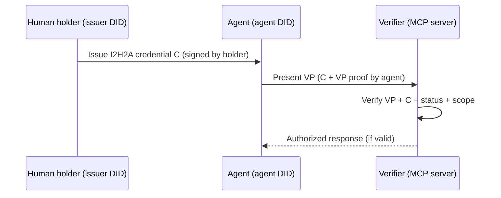

# I2H2A Specification v1.0

## Issuer to Holder to Agent Delegation Credential

**Version:** 1.0  
**Status:** Draft  
**Date:** 2026-04-12

---

### Abstract

Autonomous AI agents increasingly act on behalf of humans at scale, yet verifiers (including MCP servers) require **cryptographic proof** that an agent is authorized to perform specific operations. Today there is no widely adopted, **standard** verifiable credential type that cleanly expresses **human-to-agent delegation** while allowing the **agent** to prove possession and to **sign its own Verifiable Presentations (VPs)** without returning to the human’s issuer for every session.

This specification defines **I2H2A** (Issuer to Holder to Agent), a **W3C Verifiable Credentials Data Model v2.0**–aligned credential type. An I2H2A credential **chains** a human holder’s identity (as issuer of the delegation) to an **agent-controlled** decentralized identifier (typically **`did:key`**), with explicit **delegation scope**, optional **opaque authorization** data for platform policy, and **revocation** via generic status-list mechanisms.

The key innovation is operational: the **holder issues** the I2H2A credential to the agent subject; the **agent** holds its own keys and **autonomously** constructs and signs VPs for verifiers. I2H2A is **DID-method agnostic** for the human and **VC-platform agnostic** for issuance and verification, enabling interoperability across wallets, identity providers, and verifier middleware without mandating any single vendor, ledger, or proprietary stack.

---

### Conceptual Overview: The Three Roles

I2H2A defines a trust chain between three distinct roles. Understanding these roles is essential before reading the normative sections.

**ISSUER — the platform**
The issuer is the platform or service that verifies the human's identity and issues the I2H2A credential. The platform acts as the trust anchor: it vouches that a real, verified human has consented to delegate authority to an agent. How the platform verifies human identity — KYC, OID4VP presentation of an existing credential, government wallet, or other mechanism — is a platform implementation decision. The I2H2A spec is silent on this. What the spec requires is that the issuer holds a DID, signs the I2H2A credential with that DID, and anchors revocation via a status list.

**HOLDER — the human user**
The human user is the delegating party. They receive the I2H2A credential after the platform verifies their identity, review the delegation scope, and consent to agent execution. The human's DID is typically ledger-anchored (e.g. did:cheqd, did:web) for long-term resolvability. The human does not need to be online after delegation — the credential carries the proof of their consent.

**AGENT — an ephemeral session**
The agent is an autonomous software process acting on behalf of the human. It holds the I2H2A credential and controls its own ephemeral did:key private key generated per session. The agent constructs and signs a Verifiable Presentation autonomously and presents it to verifiers (e.g. MCP servers). No round-trip to the issuer or holder is required at presentation time. The agent's did:key is intentionally ephemeral — scoped to a single session and discarded after use.

**The trust chain**

    Issuer (Platform DID)
        |  issues and signs I2H2A credential
        v
    Human Holder (ledger-anchored DID)
        |  delegates scope to agent
        v
    Agent (ephemeral did:key)
        |  constructs and signs VP
        v
    Verifier (MCP server, API, policy enforcement point)

The full chain is cryptographically walkable from verifier back to the issuer's trust registry without requiring any platform-specific infrastructure. Any conformant verifier can walk the chain independently.

---

### 1. Terminology

The key words **MUST**, **MUST NOT**, **REQUIRED**, **SHALL**, **SHALL NOT**, **SHOULD**, **SHOULD NOT**, **RECOMMENDED**, **MAY**, and **OPTIONAL** are to be interpreted as described in [RFC 2119](https://www.rfc-editor.org/rfc/rfc2119) and [RFC 8174](https://www.rfc-editor.org/rfc/rfc8174) when, and only when, they appear in all capitals, as normative requirements in this document.

- **Issuer (I2H2A, H2A):** The **human holder** who issues the I2H2A credential to the agent. In the H2A model, the issuer **MUST** be the same entity as the **delegating human holder** identified by `credentialSubject.delegatedBy` (see Section 2).

- **Holder (I2H2A, H2A):** The party that **controls** the I2H2A credential after issuance. In H2A, the **agent** is the **holder** of the I2H2A credential for presentation purposes; the **human** is the **issuer**. This document uses “holder” in the W3C sense when referring to **presentation**, and “human holder” when referring to the **issuer** role.

- **Agent:** An autonomous system (software process) identified by **`credentialSubject.id`** (typically `did:key` for ephemeral sessions). The agent **MUST** control the private keys associated with its DID and **MUST** sign VPs with those keys.

- **Verifier:** A system that receives a Verifiable Presentation and **MUST** execute the verification algorithm in Section 4 before relying on the delegation. Examples include MCP servers, APIs, and policy enforcement points.

- **Delegation Scope:** Constraints embedded in `credentialSubject.scope` that describe **what** the agent is permitted to do (e.g., which MCP servers, which task class, optional limits). Verifiers **MUST** enforce scope as specified in Section 4.

- **Authorization Payload:** The `credentialSubject.authorization` object. It is **opaque** to generic I2H2A verifiers: they **MUST NOT** interpret its inner structure for baseline conformance; platform-specific verifiers **MAY** apply additional policy.

- **Delegation Depth:** Non-negative integer. For **V1**, `delegationDepth` **MUST** be `0` (terminal delegation; no sub-delegation). Future versions **MAY** define H2A2A chains with `delegationDepth > 0`.

- **Status List:** A registry-backed mechanism (e.g., Status List 2021, Bitstring Status List, or other interoperable status mechanisms) used to determine whether a credential remains valid or has been suspended/revoked.

---

### 2. I2H2A Credential Schema

#### 2.1 Conformance

An **I2H2A credential** is a **W3C Verifiable Credential** that:

1. **MUST** include `I2H2A` in the `type` array.
2. **MUST** conform to constraints in this section for **V1** interoperability.

#### 2.2 JSON representation (informative structure)

The following properties **MUST** appear as specified. Additional properties **MAY** be present per [VC Data Model v2.0](https://www.w3.org/TR/vc-data-model-2.0/) rules for extension.

| Property | Requirement |
|----------|---------------|
| `@context` | **MUST** be an array including `https://www.w3.org/2018/credentials/v1` and `https://i2h2a.org/contexts/v1` |
| `type` | **MUST** include `VerifiableCredential` and `I2H2A` |
| `issuer` | **MUST** be a string **DID** identifying the human holder (any DID method) |
| `issuanceDate` | **MUST** be an ISO 8601 datetime |
| `expirationDate` | **MUST** be an ISO 8601 datetime strictly after `issuanceDate` |
| `credentialSubject` | **MUST** be an object conforming to Section 2.3 |
| `credentialStatus` | **MUST** be an object conforming to Section 2.4 |

#### 2.3 `credentialSubject`

The `credentialSubject` object **MUST** contain:

| Property | Requirement |
|----------|---------------|
| `id` | **MUST** be the agent’s DID (typically `did:key` for ephemeral use) |
| `scope` | **MUST** be an object with `mcpServers` (array of strings), `taskType` (string), and **MAY** include `constraints` (object) |
| `authorization` | **MUST** be present; **MAY** be an empty object `{}`. Generic I2H2A verifiers **MUST NOT** require understanding its contents |
| `delegatedBy` | **MUST** equal the human holder DID (same as `issuer` for H2A) |
| `parentCredential` | **MUST** be `null` for V1 |
| `delegationDepth` | **MUST** be the integer `0` for V1 |

#### 2.4 `credentialStatus`

The `credentialStatus` object **MUST** contain:

| Property | Requirement |
|----------|---------------|
| `id` | **MUST** be a URI identifying the status entry or list entry resource |
| `type` | **MUST** identify the status mechanism (e.g., `StatusList2021Entry`, `BitstringStatusListEntry`) |
| `statusListIndex` | **MUST** be a non-negative integer index into the status list |
| `statusListCredential` | **MUST** be a URI that resolves to the status list credential or list resource |

> **Note:** Exact field names for status entries **MAY** follow the referenced status-list specification; verifiers **MUST** implement Appendix A consistently with the chosen status-list type.

#### 2.5 JSON-LD context (normative fragment)

The resource at `https://i2h2a.org/contexts/v1` **SHOULD** define terms used by I2H2A deployments. The following **JSON-LD** `@context` document is **non-normative** but illustrates expected term definitions for interoperability tooling:

```json
{
  "@context": {
    "@version": 1.1,
    "@protected": true,
    "I2H2A": "https://i2h2a.org/vocab#I2H2A",
    "delegatedBy": "https://i2h2a.org/vocab#delegatedBy",
    "parentCredential": "https://i2h2a.org/vocab#parentCredential",
    "delegationDepth": "https://i2h2a.org/vocab#delegationDepth",
    "scope": "https://i2h2a.org/vocab#scope",
    "mcpServers": "https://i2h2a.org/vocab#mcpServers",
    "taskType": "https://i2h2a.org/vocab#taskType",
    "constraints": "https://i2h2a.org/vocab#constraints",
    "authorization": "https://i2h2a.org/vocab#authorization"
  }
}
```

#### 2.6 JWT-VC encoding (VC secured with JWT)

When the I2H2A credential is transported as a **JWT-secured** VC, implementations **SHOULD** follow W3C guidance for securing VCs with JWTs.

- **Header:** **MUST** include `"typ": "JWT"` and **MUST** identify a supported signing algorithm (e.g., `EdDSA` where Ed25519 is used).
- **Payload:** **MUST** contain the VC claims in a conformant layout. Common patterns include wrapping the VC under a `vc` property or using registered JWT claims (`iss`, `sub`, `nbf`, `exp`) together with VC content; **either** approach **MAY** be used if the verifier can deterministically recover the I2H2A credential object for verification.

Normative minimum for interoperability:

- The verifier **MUST** be able to extract: issuer DID, subject DID (`credentialSubject.id`), `scope`, `delegatedBy`, `parentCredential`, `delegationDepth`, `credentialStatus`, and validity times.

---

### 3. JWT-VC Format Examples

The following examples are **illustrative**. Placeholder signatures are shown; production systems **MUST** use real cryptographic signatures.

#### 3.1 Example 1 — `did:cheqd` holder, `did:key` agent

**Full JWT (illustrative, single line):**

```
eyJhbGciOiJFZERTQSIsInR5cCI6IkpXVCJ9.eyJpc3MiOiJkaWQ6Y2hlcWQ6dGVzdG5ldDphYmMxMjMtMDAwMC0wMDAwLTAwMDAtMDAwMDAwMDAwMDAxIiwic3ViIjoiZGlkOmtleTp6Nk1rZmFrZUFnZW50S2V5MSIsIm5iZiI6MTcxMjk5ODQwMCwiZXhwIjoxNzEzMDg0ODAwLCJ2YyI6eyJAY29udGV4dCI6WyJodHRwczovL3d3dy53My5vcmcvMjAxOC9jcmVkZW50aWFscy92MSIsImh0dHBzOi8vaTJoMmEub3JnL2NvbnRleHRzL3YxIl0sInR5cGUiOlsiVmVyaWZpYWJsZUNyZWRlbnRpYWwiLCJJMkgyQSJdLCJjcmVkZW50aWFsU3ViamVjdCI6eyJpZCI6ImRpZDprZXk6ejZNa2Zha2VBZ2VudEtleTEiLCJzY29wZSI6eyJtY3BTZXJ2ZXJzIjpbImFtYXpvbi1tY3AiLCJlYmF5LW1jcCJdLCJ0YXNrVHlwZSI6InByb2R1Y3Rfc2VhcmNoIn0sImF1dGhvcml6YXRpb24iOnt9LCJkZWxlZ2F0ZWRCeSI6ImRpZDpjaGVxZDp0ZXN0bmV0OmFiYzEyMy0wMDAwLTAwMDAtMDAwMC0wMDAwMDAwMDAwMDEiLCJwYXJlbnRDcmVkZW50aWFsIjpudWxsLCJkZWxlZ2F0aW9uRGVwdGgiOjB9LCJjcmVkZW50aWFsU3RhdHVzIjp7ImlkIjoiaHR0cHM6Ly9zdGF0dXMubGlzdC9lbnRyeS9jaGVxZC0xIiwidHlwZSI6IlN0YXR1c0xpc3QyMDIxRW50cnkiLCJzdGF0dXNMaXN0SW5kZXgiOjQyLCJzdGF0dXNMaXN0Q3JlZGVudGlhbCI6Imh0dHBzOi8vZXhhbXBsZS5vcmcvc3RhdHVzLWxpc3RzL2NoZXFkLWxpc3QtMSJ9fX0.SIGNATURE_ILLUSTRATIVE_CHEQD_H2A
```

**Decoded header:**

```json
{
  "alg": "EdDSA",
  "typ": "JWT"
}
```

**Decoded payload (pretty-printed):**

```json
{
  "iss": "did:cheqd:testnet:abc123-0000-0000-0000-000000000001",
  "sub": "did:key:z6MfakeAgentKey1",
  "nbf": 1712998400,
  "exp": 1713084800,
  "vc": {
    "@context": [
      "https://www.w3.org/2018/credentials/v1",
      "https://i2h2a.org/contexts/v1"
    ],
    "type": ["VerifiableCredential", "I2H2A"],
    "credentialSubject": {
      "id": "did:key:z6MfakeAgentKey1",
      "scope": {
        "mcpServers": ["amazon-mcp", "ebay-mcp"],
        "taskType": "product_search"
      },
      "authorization": {},
      "delegatedBy": "did:cheqd:testnet:abc123-0000-0000-0000-000000000001",
      "parentCredential": null,
      "delegationDepth": 0
    },
    "credentialStatus": {
      "id": "https://status.list/entry/cheqd-1",
      "type": "StatusList2021Entry",
      "statusListIndex": 42,
      "statusListCredential": "https://example.org/status-lists/cheqd-list-1"
    }
  }
}
```

**Signature verification note:** The verifier **MUST** resolve `iss` (holder DID), obtain verification methods, and verify the JWT signature per JOSE rules. Separately, the VP **MUST** be verified as in Section 4 (agent key + embedded credential).

---

#### 3.2 Example 2 — `did:web` holder, `did:key` agent (Bitstring status list)

**Full JWT (illustrative):**

```
eyJhbGciOiJFZERTQSIsInR5cCI6IkpXVCJ9.eyJpc3MiOiJkaWQ6d2ViOmV4YW1wbGUuY29tOnVzZXJzOmFsaWNlIiwic3ViIjoiZGlkOmtleTp6Nk1rZmFrZUFnZW50S2V5MiIsIm5iZiI6MTcxMjk5ODQwMCwiZXhwIjoxNzEzMDg0ODAwLCJ2YyI6eyJAY29udGV4dCI6WyJodHRwczovL3d3dy53My5vcmcvMjAxOC9jcmVkZW50aWFscy92MSIsImh0dHBzOi8vaTJoMmEub3JnL2NvbnRleHRzL3YxIl0sInR5cGUiOlsiVmVyaWZpYWJsZUNyZWRlbnRpYWwiLCJJMkgyQSJdLCJjcmVkZW50aWFsU3ViamVjdCI6eyJpZCI6ImRpZDprZXk6ejZNa2Zha2VBZ2VudEtleTIiLCJzY29wZSI6eyJtY3BTZXJ2ZXJzIjpbInN0cmlwZS1tY3AiXSwidGFza1R5cGUiOiJwYXltZW50X3Byb2Nlc3NpbmcifSwiYXV0aG9yaXphdGlvbiI6e30sImRlbGVnYXRlZEJ5IjoiZGlkOndlYjpleGFtcGxlLmNvbTp1c2VyczphbGljZSIsInBhcmVudENyZWRlbnRpYWwiOm51bGwsImRlbGVnYXRpb25EZXB0aCI6MH0sImNyZWRlbnRpYWxTdGF0dXMiOnsiaWQiOiJodHRwczovL2V4YW1wbGUuY29tL3N0YXR1cy9iaXRzdHJpbmcvZW50cnkvMyIsInR5cGUiOiJCaXRzdHJpbmdTdGF0dXNMaXN0RW50cnkiLCJzdGF0dXNMaXN0SW5kZXgiOjMsInN0YXR1c0xpc3RDcmVkZW50aWFsIjoiaHR0cHM6Ly9leGFtcGxlLmNvbS8ud2VsbC1rbm93bi9zdGF0dXMtbGlzdC5qc29uIn19fQ.SIGNATURE_ILLUSTRATIVE_DIDWEB_H2A
```

**Decoded header:**

```json
{
  "alg": "EdDSA",
  "typ": "JWT"
}
```

**Decoded payload (excerpt):**

```json
{
  "iss": "did:web:example.com:users:alice",
  "sub": "did:key:z6MfakeAgentKey2",
  "vc": {
    "type": ["VerifiableCredential", "I2H2A"],
    "credentialSubject": {
      "id": "did:key:z6MfakeAgentKey2",
      "scope": {
        "mcpServers": ["stripe-mcp"],
        "taskType": "payment_processing"
      },
      "authorization": {},
      "delegatedBy": "did:web:example.com:users:alice",
      "parentCredential": null,
      "delegationDepth": 0
    },
    "credentialStatus": {
      "id": "https://example.com/status/bitstring/entry/3",
      "type": "BitstringStatusListEntry",
      "statusListIndex": 3,
      "statusListCredential": "https://example.com/.well-known/status-list.json"
    }
  }
}
```

---

#### 3.3 Example 3 — `did:ion` holder, `did:key` agent

**Full JWT (illustrative):**

```
eyJhbGciOiJFZERTQSIsInR5cCI6IkpXVCJ9.eyJpc3MiOiJkaWQ6aW9uOkVpRGVtb0lvbkhvbGRlciIsInN1YiI6ImRpZDprZXk6ejZNa2Zha2VBZ2VudEtleTMiLCJuYmYiOjE3MTI5OTg0MDAsImV4cCI6MTcxMzA4NDgwMCwidmMiOnsiQGNvbnRleHQiOlsiaHR0cHM6Ly93d3cudzMub3JnLzIwMTgvY3JlZGVudGlhbHMvdjEiLCJodHRwczovL2kyaDJhLm9yZy9jb250ZXh0cy92MSJdLCJ0eXBlIjpbIlZlcmlmaWFibGVDcmVkZW50aWFsIiwiSTJIMkEiXSwiY3JlZGVudGlhbFN1YmplY3QiOnsiaWQiOiJkaWQ6a2V5Ono2TWtmYWtlQWdlbnRLZXkzIiwic2NvcGUiOnsibWNwU2VydmVycyI6WyJnbWFpbC1tY3AiLCJzbGFjay1tY3AiXSwidGFza1R5cGUiOiJjb21tdW5pY2F0aW9uIn0sImF1dGhvcml6YXRpb24iOnt9LCJkZWxlZ2F0ZWRCeSI6ImRpZDppb246RWlEZW1vSW9uSG9sZGVyIiwicGFyZW50Q3JlZGVudGlhbCI6bnVsbCwiZGVsZWdhdGlvbkRlcHRoIjowfSwiY3JlZGVudGlhbFN0YXR1cyI6eyJpZCI6Imh0dHBzOi8vaW9uLmV4YW1wbGUvc3RhdHVzL2VudHJ5LzkiLCJ0eXBlIjoiU3RhdHVzTGlzdDIwMjFFbnRyeSIsInN0YXR1c0xpc3RJbmRleCI6OSwic3RhdHVzTGlzdENyZWRlbnRpYWwiOiJodHRwczovL2lvbi5leGFtcGxlL3JlZ2lzdHJ5L2xpc3QtMSJ9fX0.SIGNATURE_ILLUSTRATIVE_ION_H2A
```

**Verification note:** Resolution paths differ by DID method, but the verification **algorithm** in Section 4 is identical after DID documents and keys are obtained.

---

### 4. Verification Algorithm

#### 4.1 Inputs and outputs

**Input:**

- `VP`: A Verifiable Presentation containing at least one verifiable credential or derivative that allows extraction of an I2H2A credential and the agent’s proof of control.

**Output:**

- `valid`: boolean  
- `errors`: array of machine-readable error descriptors (implementation-defined strings or codes)

#### 4.2 Normative steps

1. **Parse VP.** The verifier **MUST** parse `VP` and extract the I2H2A credential `C`. If `C` cannot be found, the verifier **MUST** return `valid = false` and an error such as `missing_i2h2a_credential`.

2. **Verify VP proof(s) by the agent.** The verifier **MUST** verify that the VP is bound to the agent DID `A = C.credentialSubject.id` using standard VP proof verification for the presentation format used. If this fails, return `valid = false`, error `vp_proof_invalid`.

3. **Verify issuer signature on `C`.** The verifier **MUST** verify the human issuer’s signature on `C` (JWT, Data Integrity proof, or other securing mechanism). If this fails, return `valid = false`, error `credential_signature_invalid`.

4. **Resolve DIDs.** The verifier **MUST** resolve `A` and `C.issuer` (and any DIDs required by the securing mechanism) and obtain authorized verification key material per DID Core.

5. **Check temporal validity.** Let `now` be the verifier’s current time. The verifier **MUST** ensure `issuanceDate ≤ now ≤ expirationDate` (with clock skew policy as a local parameter). If not, return `valid = false`, error `credential_expired` or `credential_not_yet_valid`.

6. **Check status.** The verifier **MUST** evaluate `C.credentialStatus` using Appendix A. If revoked/suspended per policy, return `valid = false`, error `credential_revoked`.

7. **Validate delegation scope.** The verifier **MUST** ensure the requested operation (e.g., MCP server id and task type) is permitted by `C.credentialSubject.scope`. If not, return `valid = false`, error `scope_violation`.

8. **Check delegation depth.** For V1, the verifier **MUST** ensure `C.credentialSubject.delegationDepth == 0`. Otherwise return `valid = false`, error `invalid_delegation_depth`.

9. **Check parent credential.** For V1, the verifier **MUST** ensure `C.credentialSubject.parentCredential == null`. Otherwise return `valid = false`, error `invalid_parent_credential`.

If all steps pass, return `valid = true` with `errors = []`.

#### 4.3 Pseudocode

```text
function verifyI2H2A(VP, requestContext) -> (valid: bool, errors: string[])
  C := extractI2H2ACredential(VP)
  if C == null then return (false, ["missing_i2h2a_credential"])

  if !verifyVpProof(VP, C.credentialSubject.id) then
    return (false, ["vp_proof_invalid"])

  if !verifyCredentialSignature(C) then
    return (false, ["credential_signature_invalid"])

  if !didResolvable(C.credentialSubject.id) or !didResolvable(C.issuer) then
    return (false, ["did_resolution_failed"])

  if !withinValidityWindow(C.issuanceDate, C.expirationDate, now()) then
    return (false, ["credential_time_invalid"])

  if !statusListSaysActive(C.credentialStatus) then
    return (false, ["credential_revoked"])

  if !scopePermits(requestContext, C.credentialSubject.scope) then
    return (false, ["scope_violation"])

  if C.credentialSubject.delegationDepth != 0 then
    return (false, ["invalid_delegation_depth"])

  if C.credentialSubject.parentCredential != null then
    return (false, ["invalid_parent_credential"])

  return (true, [])
```

---

### 5. H2A Chain Model

#### 5.1 Participants

| Role | Description |
|------|-------------|
| Human holder | Issues I2H2A to the agent; controls human DID keys |
| Agent | Holds I2H2A credential and agent DID keys; constructs VPs |
| Verifier | Validates VPs and enforces scope (e.g., MCP server) |

#### 5.2 Flow (normative narrative)

1. **Delegation setup:** The human holder **MUST** generate or obtain an agent DID `did:key` (or other). The holder **MUST** issue `C` to the agent and transmit `C` to the agent through a secure channel.

2. **Session initiation:** The agent **MUST** form a VP that includes `C` (or a digest strategy permitted by the verifier) and **MUST** sign the VP with the agent DID key.

3. **Verification:** The verifier **MUST** run Section 4. On success, the verifier **MAY** execute the requested operation on behalf of the agent within scope.

4. **Revocation:** The holder (or designated status administrator) **MUST** update the status list so future checks fail at step 6 of Section 4.

#### 5.3 Diagram (Mermaid)



---

### 6. Security Considerations

#### 6.1 Agent key management

- **Ephemeral `did:key`:** **RECOMMENDED** for short-lived sessions; limits blast radius if leaked.
- **Persistent agent DIDs:** **MAY** be used when continuity is required; trade-off is more operational burden.
- **Private key storage:** Agents **SHOULD** store keys in OS secure storage, KMS, HSM, or hardened enclaves appropriate to deployment.

#### 6.2 Revocation mechanisms

- **Latency:** Status updates **MAY** lag; verifiers **SHOULD** define maximum staleness for risk tolerance.
- **Granularity:** Revocation is typically per index entry; batch updates **MAY** be used operationally.
- **Caching:** Verifiers **MAY** cache status lists but **MUST** bound cache TTL for security-sensitive deployments.

#### 6.3 Delegation scope enforcement

- Verifiers **MUST** treat scope as authoritative for what operations are allowed.
- Agents **MUST NOT** be trusted to self-enforce beyond scope; enforcement is a **verifier** responsibility.

#### 6.4 Replay attack prevention

- VPs **SHOULD** include nonces, audience binding, or short-lived challenge responses where applicable.
- Presentation protocols **SHOULD** bind VPs to a session identifier.

#### 6.5 Issuer compromise

- If the holder’s keys are compromised, an attacker **MAY** mint new delegations. Mitigations include short `expirationDate`, monitoring, DID rotation, and organizational policy.

---

### 7. Interoperability

#### 7.1 VC platforms

I2H2A **MAY** be issued by any VC-capable platform conforming to W3C VC Data Model v2.0. Platform-specific features **MUST NOT** be required for baseline verification.

#### 7.2 DID methods

- Holder DIDs **MAY** use any interoperable DID method.
- Agent DIDs **SHOULD** commonly use `did:key` for lightweight operation.
- Verifiers **MUST** support resolving DIDs required by presented credentials.

#### 7.3 Wallet integration

- Wallets **MAY** store and present I2H2A credentials using OID4VP or other presentation protocols.

#### 7.4 MCP integration

- MCP servers **SHOULD** accept VPs via OAuth 2.1–aligned bearer token profiles where applicable.
- Middleware **MAY** centralize verification per Section 4.

---

### 8. Appendix A: Status List Verification

#### 8.1 Generic algorithm

**Input:** `credentialStatus` object `S` from credential `C`.

**Steps:**

1. Fetch the resource at `S.statusListCredential` per local security policy (TLS, allowlists).
2. Parse the status list credential per its `type` (Status List 2021, Bitstring Status List, etc.).
3. Obtain the bitstring (or equivalent) and determine the meaning of index `S.statusListIndex` for revocation/suspension per the status-list specification.
4. If the entry indicates revoked/suspended per verifier policy, treat as inactive.

#### 8.2 Pseudocode

```text
function statusListSaysActive(S) -> bool
  L := fetch(S.statusListCredential)
  bits := extractBitstring(L, typeOf(S))
  entry := readBit(bits, S.statusListIndex)
  // Meaning of 0/1 depends on list profile; verifier MUST implement profile rules
  return entry == ACTIVE_BIT_FOR_PROFILE
```

#### 8.3 Platform notes (informative)

- **Ledger-anchored lists** may have confirmation delays.
- **Web-hosted lists** may update quickly but centralize trust in hosting.

---

### 9. Appendix B: DID Method Examples (informative)

#### 9.1 `did:cheqd` (illustrative)

- **Example DID:** `did:cheqd:testnet:550e8400-e29b-41d4-a716-446655440000`
- **Resolution:** Use a cheqd-compliant DID resolver or universal resolver.
- **DID document excerpt:**

```json
{
  "id": "did:cheqd:testnet:550e8400-e29b-41d4-a716-446655440000",
  "verificationMethod": [
    {
      "id": "#key-1",
      "type": "Ed25519VerificationKey2020",
      "controller": "did:cheqd:testnet:550e8400-e29b-41d4-a716-446655440000",
      "publicKeyMultibase": "z6MkEXAMPLE"
    }
  ],
  "assertionMethod": ["#key-1"]
}
```

#### 9.2 `did:key` (illustrative)

- **Example DID:** `did:key:z6MkhaXgBZDvotDkSpt3czC4krxQCBEzB1c7tgddkmHLbJQe`
- **Resolution:** Derived deterministically from embedded public key material per `did:key` rules.

#### 9.3 `did:web` (illustrative)

- **Example DID:** `did:web:example.com:users:alice`
- **Resolution:** HTTPS GET of the DID document URL under the `did:web` rules.

---

### 10. References

- W3C Verifiable Credentials Data Model v2.0  
- W3C Decentralized Identifiers (DIDs) v1.0  
- W3C Status List 2021  
- W3C Bitstring Status List (where applicable)  
- OpenID for Verifiable Credential Issuance (OID4VCI)  
- OpenID for Verifiable Presentations (OID4VP)  
- RFC 7519: JSON Web Token (JWT)  
- RFC 8017: PKCS #1  
- RFC 8032: Edwards-Curve Digital Signature Algorithm (EdDSA)  
- RFC 2119 / RFC 8174: Requirement level keywords  

---

*End of I2H2A Specification v1.0*
